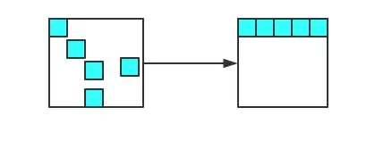

# JavaScript内存回收机制

## JavaScript中数据是如何存储的

基本数据类型存储在栈内存中，引用数据类型存储在堆内存中。

其中基本类型包括：

+ Boolean
+ Null
+ Undefined
+ Number
+ String
+ Symbol (ES2015)
+ Bigint (ES 2019)

而所有的对象数据类型都存放在堆中。

对于赋值操作，原始数据类型数据直接完整的复制变量值，对象数据类型的数据则是复制引用的地址。

## 栈内存的回收

对于系统栈来说，它的功能除了保存变量外，还有创建并切换函数执行上下文的功能。

举个例子：

```js
function f(a) {
  console.log(a)
}

function func(a) {
  f(a)
}

func(1)
```

假设用ESP指针来保存当前的执行状态，在系统栈中会产生如下的过程：

1. 调用func, 将 func 函数的上下文压栈，ESP指向栈顶。
2. 执行func，又调用f函数，将 f 函数的上下文压栈，ESP 指针上移。
3. 执行完 f 函数，将ESP 下移，f函数对应的栈顶空间被回收。
4. 执行完 func，ESP 下移，func对应的空间被回收。

图示如下：


所以对于栈内存来说，ESP指针下移，系统就会回收栈顶的内存空间。

如果采用栈来存储相对基本类型更加复杂的对象数据，那么切换上下文的开销将变得巨大。不过堆内存虽然空间大，能存放大量的数据，但与此同时垃圾内存的回收会带来更大的开销。

## V8引擎的垃圾回收机制

### V8 内存限制

在其他的后端语言中，如Java/Go, 对于内存的使用没有什么限制，但是JS不一样，V8只能使用系统的一部分内存，具体来说，在**64**位系统下，V8最多只能分配**1.4G**, 在**32** 位系统中，最多只能分配**0.7G**。你想想在前端这样的大内存需求其实并不大，但对于后端而言，nodejs如果遇到一个2G多的文件，那么将无法全部将其读入内存进行各种操作了。

那么问题来了，V8 为什么要给它设置内存上限？明明我的机器大几十G的内存，只能让我用这么一点？

究其根本，是由两个因素所共同决定的，一个是**JS单线程的执行机制**，另一个是**JS垃圾回收机制的限制**。

首先JS是单线程运行的，这意味着一旦进入到垃圾回收，那么其它的各种运行逻辑都要暂停; 另一方面垃圾回收其实是非常耗时间的操作，V8 官方是这样形容的:

> 以 1.5GB 的垃圾回收堆内存为例，V8 做一次小的垃圾回收需要50ms 以上，做一次非增量式(ps:后面会解释)的垃圾回收甚至要 1s 以上。

可见其耗时之久，而且在这么长的时间内，我们的JS代码执行会一直没有响应，造成应用卡顿，导致应用性能和响应能力直线下降。因此，V8 做了一个简单粗暴的选择，那就是限制堆内存，也算是一种权衡的手段，因为大部分情况是不会遇到操作几个G内存这样的场景的。

不过，如果你想调整这个内存的限制也不是不行。配置命令如下:

```js
// 这是调整老生代这部分的内存，单位是MB。
node --max-old-space-size=2048 xxx.js 
// 这是调整新生代这部分的内存，单位是 KB。
node --max-new-space-size=2048 xxx.js
```

### 新生代内存的回收

V8 把堆内存分成了两部分进行处理——新生代内存和老生代内存。顾名思义，新生代就是临时分配的内存，存活时间短， 老生代是常驻内存，存活的时间长。V8 的堆内存，也就是两个内存之和。


根据这两种不同种类的堆内存，V8 采用了不同的回收策略，来根据不同的场景做针对性的优化。

首先是新生代的内存，刚刚已经介绍了调整新生代内存的方法，那它的内存默认限制是多少？在 64 位和 32 位系统下分别为 32MB 和 16MB。够小吧，不过也很好理解，新生代中的变量存活时间短，来了马上就走，不容易产生太大的内存负担，因此可以将它设的足够小。

那好了，新生代的垃圾回收是怎么做的呢？

首先将新生代内存空间一分为二:


其中From部分表示正在使用的内存，To 是目前闲置的内存。

当进行垃圾回收时，V8 将From部分的对象检查一遍，如果是存活对象那么复制到To内存中(在To内存中按照顺序从头放置的)，如果是非存活对象直接回收即可。

当所有的From中的存活对象按照顺序进入到To内存之后，From 和 To 两者的角色`对调`，From现在被闲置，To为正在使用，如此循环。

之所以使用这种方法是为了应对这样的场景:


深色的小方块代表存活对象，白色部分表示待分配的内存，由于堆内存是连续分配的，这样零零散散的空间可能会导致稍微大一点的对象没有办法进行空间分配，这种零散的空间也叫做**内存碎片**。刚刚介绍的新生代垃圾回收算法也叫**Scavenge算法**。

Scavenge 算法主要就是解决内存碎片的问题，在进行一顿复制之后，To空间变成了这个样子:


是不是整齐了许多？这样就大大方便了后续连续空间的分配。不过Scavenge 算法的劣势也非常明显，就是内存只能使用新生代内存的一半，但是它只存放生命周期短的对象，这种对象`一般很少`，因此`时间`性能非常优秀。

### 老生代内存的回收

#### 晋升

刚刚介绍了新生代的回收方式，那么新生代中的变量如果经过多次回收后依然存在，那么就会被放入到`老生代内存`中，这种现象就叫`晋升`。

发生晋升其实不只是这一种原因，我们来梳理一下会有那些情况触发晋升:

+ 已经经历过一次 Scavenge 回收。
+ To（闲置）空间的内存占用超过25%。

#### 内存回收

现在进入到老生代的垃圾回收机制当中，老生代中累积的变量空间一般都是很大的，当然不能用`Scavenge`算法啦，浪费一半空间不说，对庞大的内存空间进行复制岂不是劳民伤财？

那么对于老生代而言，究竟是采取怎样的策略进行垃圾回收的呢？

1. 第一步，进行标记-清除。这个过程在《JavaScript高级程序设计(第三版)》中有过详细的介绍，主要分成两个阶段，即标记阶段和清除阶段。首先会遍历堆中的所有对象，对它们做上标记，然后对于代码环境中`使用的变量`以及被`强引用`的变量取消标记，剩下的就是要删除的变量了，在随后的`清除阶段`对其进行空间的回收。

   当然这又会引发内存碎片的问题，存活对象的空间不连续对后续的空间分配造成障碍。老生代又是如何处理这个问题的呢？

2. 整理内存碎片。V8 的解决方式非常简单粗暴，在清除阶段结束后，把存活的对象全部往一端靠拢。



​由于是移动对象，它的执行速度不可能很快，事实上也是整个过程中最耗时间的部分。

#### 增量标记

由于JS的单线程机制，V8 在进行垃圾回收的时候，不可避免地会阻塞业务逻辑的执行，倘若老生代的垃圾回收任务很重，那么耗时会非常可怕，严重影响应用的性能。那这个时候为了避免这样问题，V8 采取了增量标记的方案，即将一口气完成的标记任务分为很多小的部分完成，每做完一个小的部分就"歇"一下，就js应用逻辑执行一会儿，然后再执行下面的部分，如果循环，直到标记阶段完成才进入内存碎片的整理上面来。其实这个过程跟React Fiber的思路有点像，这里就不展开了。

经过增量标记之后，垃圾回收过程对JS应用的阻塞时间减少到原来了1 / 6, 可以看到，这是一个非常成功的改进。
